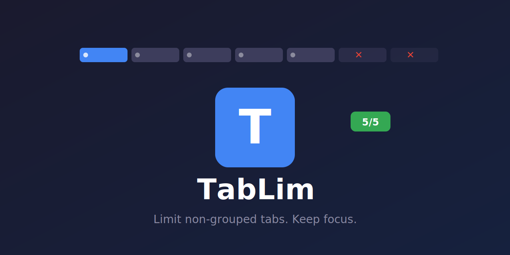

# TabLim

Limit the maximum number of non-grouped tabs in Chrome.

## Install

1. Go to `chrome://extensions`
2. Enable **Developer mode**
3. Click **Load unpacked**
4. Select the `tablim` folder

## Usage

Click the extension icon to set your max tab limit (default: 10).

- Only non-grouped tabs count toward the limit
- Grouped tabs are ignored
- New tabs beyond the limit are automatically closed

## How it works

| Feature | Description |
|---------|-------------|
| Tab limit | Set max number of ungrouped tabs |
| Group-aware | Tabs in groups don't count |
| Auto-block | Excess tabs closed instantly |
